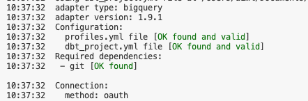
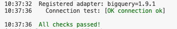
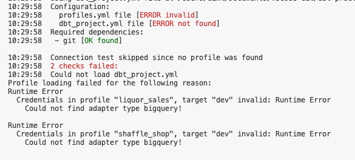
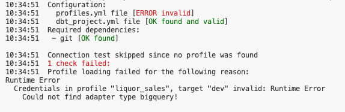
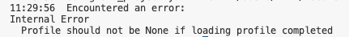
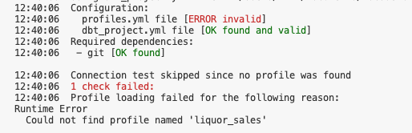

# dbt Setup Notes

## Requirements
- Need Google account and Sign-up with Bigquery
- Use `gcloud auth application-default login` to create easy access to Google Bigquery
- Get Google Bigquery Project name ready, if not create a new project.
- In Bigquery, create a dataset (This is optional, dbt able to create dataset for you under the profile settings. Please note that some public datasets which are under EU region such as London bicycle, we need to create the dataset in Bigquery first while setting the region to EU.)


## Key dbt Commands
The following are dbt key commands:
- `dbt init <dbt-project-name>` : dbt init perform 2 tasks, first it create a subfolder with the project name and also populate multiple subfolder that dbt required inside the project folder. dbt also setup connection profile automatically including its authentication method. This command is not suitable for existing project. Please run this command under the root/home folder if you have many project folders.

The following command **MUST** be run under the **specific project folder**.
- `dbt debug` : Use this command to verified your connection in your profile.
- `dbt run` : Use this command to run all the SQL script setup in the dbt folders.
- `dbt snapshot` : Use this command to build snapshot
- `dbt test` : Use this command to test the database field. Similar to constraints during database table setup. However, dbt uses schema.yml file for configuration
- `dbt seed` : Use this command to convert CSV files into database table


## dbt init

Reference: https://docs.getdbt.com/reference/commands/init

When we initiate `dbt init <dbt-project-name>`, dbt will perform 2 tasks below:
1. dbt init first task is to create all the necessary subfolder for your project under the name of your project. If there is an existing folder with the same name as the project name, the init will fail.
2. Next dbt will setup your profile automatically, this includes setting up your authentication method to the data warehouse.

### dbt Folder Setup
- If there is an existing folder that is same as the project name. It will failed.
- **Please check your directory location! Please do not perform init within another dbt project. Always start init at the root/home folder.**


### dbt Profile
Please note that there are multiple ways for dbt to work with profile, they are:
- Automatic profile setup, dbt will always look at the default profile located at `/Users/USER/.dbt/profiles.yml`. If dbt found the same project name under your default profile, it will ask if you want to overwrite it. Otherwise, dbt will configure the profile over there. This is the recommend profile location as the profile may contain sensitive information that is not appropriate for Github exposure.
- Using existing profile setup by ourselves. We can supplied and configure our own profile.

### dbt Authentication
- Oauth : If you have previously use `gcloud auth application-default login` in your environment, oauth is recommend as no extra steps is needed.
- Service Account : You need to create a service key in json from Google. This service key need to reside on a secure location that is accessible by the dbt system. A recommended location is the same location as the default profile (`profiles.yml`) location; which is at (`/Users/USER/.dbt/`). On how to generate service key please refer to this page: https://docs.getdbt.com/guides/bigquery?step=4.

### dbt init - Automatic Profile Creation with Oauth
- **Please check your directory location! Please do not perform init within another dbt project. Always start init at the root folder. Init will fail if there is an existing folder with the same project name.**
- When you run `dbt init <dbt-project-name>` it will create a folder with that project name and all the necessary subfolder.
- Next it will automatically create a connection profile for you, based on the answer you supplied. For Mac user, the profile is located at `/Users/USER/.dbt/profiles.yml`

#### Automatic Profile Setup Question
> - Which database would you like to use? >> Select [1] bigquery
> - Desired authentication method option (enter a number): >> Select 1 for oauth, 2 for service account
> - project (GCP project id): >> YourGoogleProject
> - dataset (the name of your dbt dataset): >> jaffle_shop (Note: you can specified the dataset you created on Bigquery, if you did not create a dataset, dbt will create one using the dataset name you supplied here)
> - threads (1 or more): >> enter a thread number
> - job_execution_timeout_seconds [300]: >> enter for default
> - Desired location option (enter a number): 1 for US and 2 for EU

**Example**

The following is a sample of automatic init
```text
% dbt init jaffle_shop
05:28:39  Running with dbt=1.9.2
05:28:39  
Your new dbt project "jaffle_shop" was created!

For more information on how to configure the profiles.yml file,
please consult the dbt documentation here:

  https://docs.getdbt.com/docs/configure-your-profile

One more thing:

Need help? Don't hesitate to reach out to us via GitHub issues or on Slack:

  https://community.getdbt.com/

Happy modeling!

05:28:39  Setting up your profile.
Which database would you like to use?
[1] bigquery

(Don't see the one you want? https://docs.getdbt.com/docs/available-adapters)

Enter a number: 1
[1] oauth
[2] service_account
Desired authentication method option (enter a number): 1
project (GCP project id): bigquery-project-name
dataset (the name of your dbt dataset): jaffle_shop
threads (1 or more): 2
job_execution_timeout_seconds [300]: 
[1] US
[2] EU
Desired location option (enter a number): 1
05:29:25  Profile jaffle_shop written to /Users/USER/.dbt/profiles.yml using target's profile_template.yml and your supplied values. Run 'dbt debug' to validate the connection.
```
**Checking Profile**

Under the folder `/Users/USER/.dbt/profiles.yml`, you should have something similar:
```shell
jaffle_shop: # profile name (usually same as the project name in auto configuration)
  outputs:
    dev: # Target, usually dev or prod to differentiate between development and production
      dataset: jaffle_shop #(Bigquery dataset, in this case I use the same name with the project name)
      job_execution_timeout_seconds: 300
      job_retries: 1
      location: US
      method: oauth
      priority: interactive
      project: bigquery-project-name
      threads: 1
      type: bigquery
  target: dev
```

### dbt init - Automatic Profile Creation with Service Account
- **Please check your directory location! Please do not perform init within another dbt project. Always start init at the root folder. Init will fail if there is an existing folder with the same project name.**
- When you run `dbt init <dbt-project-name>` it will create a folder with that project name and all the necessary subfolder.
- Next it will automatically create a connection profile for you, based on the answer you supplied. For Mac user, the profile is located at `/Users/USER/.dbt/profiles.yml`

#### Automatic Profile Setup Question
> - Which database would you like to use? >> Select [1] bigquery
> - Desired authentication method option (enter a number): >> 2 (Select 1 for oauth, 2 for service account)
> - keyfile (/path/to/bigquery/keyfile.json): /Users/USER/.dbt/name-of-your-service-key-created-in-Google.json
> - project (GCP project id): >> YourGoogleProject
> - dataset (the name of your dbt dataset): >> **liquor_sales** (Note: you can specified the dataset you created on Bigquery, if you did not create a dataset, dbt will create one using the dataset name you supplied here)
> - threads (1 or more): >> enter a thread number
> - job_execution_timeout_seconds [300]: >> enter for default
> - Desired location option (enter a number): 1 for US and 2 for EU

**Example**

The following is an example, the process is the same except that we use service account.
```text
% dbt init liquor_sales
09:09:22  Running with dbt=1.9.2
09:09:22  
Your new dbt project "liquor_sales" was created!

For more information on how to configure the profiles.yml file,
please consult the dbt documentation here:

  https://docs.getdbt.com/docs/configure-your-profile

One more thing:

Need help? Don't hesitate to reach out to us via GitHub issues or on Slack:

  https://community.getdbt.com/

Happy modeling!

09:09:22  Setting up your profile.
Which database would you like to use?
[1] bigquery

(Don't see the one you want? https://docs.getdbt.com/docs/available-adapters)

Enter a number: 1
[1] oauth
[2] service_account
Desired authentication method option (enter a number): 2
keyfile (/path/to/bigquery/keyfile.json): /Users/USER/.dbt/name-of-your-service-key-created-in-Google.json
project (GCP project id): bigquery-project-name
dataset (the name of your dbt dataset): iowa_liquor_sales
threads (1 or more): 1
job_execution_timeout_seconds [300]: 
[1] US
[2] EU
Desired location option (enter a number): 1
09:11:08  Profile liquor_sales written to /Users/USER/Documents/VSCode-Git/dbt-practice/profiles.yml using target's profile_template.yml and your supplied values. Run 'dbt debug' to validate the connection.
```

**Checking Profile**

Under the folder `/Users/USER/.dbt/profiles.yml`, you should have something similar:
```shell
liquor_sales: # profile name (usually same as the project name in auto configuration)
  outputs:
    dev:
      dataset: iowa_liquor_sales # This dataset is not create in Bigquery yet. dbt should able to create it automatically.
      job_execution_timeout_seconds: 300
      job_retries: 1
      keyfile: /Users/USER/.dbt/name-of-your-service-key-created-in-Google.json # Under service account we need to specify the location of the keyfile
      location: US
      method: service-account
      priority: interactive
      project: bigquery-project-name
      threads: 2
      type: bigquery
  target: dev

```


### dbt init - Custom Profile Creation with Oauth
The following is to initialize a dbt project using existing profile:

First we need a profile setup, see a sample profile:
```yaml
## Custom dbt profile
## Reference: https://docs.getdbt.com/docs/core/connect-data-platform/bigquery-setup

# The first line is the profile name. This is where dbt looks for from dbt_project.yml -> find the named profile here. 
# Can also be overwritten by dbt run --profiles. See dbt run --help for more info
london_bicycle: # profile name (In this case where profile name come first, the project name will follow the profile name)
  # default target for profile, points to 1 of the output below # define target in dbt CLI via --target
  target: dev # Usually either dev or production
  outputs:
    threads: 1
    location: EU
    priority: interactive
    dev:
      type: bigquery
      method: oauth 
      project: bigquery-project-name
      dataset: london_bike # For this london dataset, we need to create dataset in Bigquery first, it can be same or different from project name
      retries: 2
  config:
    send_anonymous_usage_stats: False
```

**IMPORTANT NOTES:**
- **The name of the file that contains the profile configuration has to be `profiles.yml`.**
- **The profile need to be located where you run `dbt init`, otherwise dbt will use to the default profile location at `/Users/USER/.dbt/profiles.yml`.**

**Where to put the profile:**
- **We can place the `profiles.yml` at the root/home folder where we collected all different dbt projects. The profiles of additional dbt projects will be recorded under `profiles.yml`.**
- **Alternatively, we can place the profile (`profiles.yml`) into each project folder. This means that each project folder contains their own profile configuration. In this case you need to physically move the file `profiles.yml` to the project subfolder after the initialization.**

The command to run the initialization is `dbt init --profile <dbt-profile-name>`. You can also run `dbt init` where it will ask you to enter the profile name. After that it will ask if you want to reset the profile configuration in your current profile.

**Example**

The following is a sample of the command output:
```text
% dbt init --profile london_bicycle
08:49:55  Running with dbt=1.9.2
Enter a name for your project (letters, digits, underscore): london_bicycle
08:50:03  
Your new dbt project "london_bicycle" was created!

For more information on how to configure the profiles.yml file,
please consult the dbt documentation here:

  https://docs.getdbt.com/docs/configure-your-profile

One more thing:

Need help? Don't hesitate to reach out to us via GitHub issues or on Slack:

  https://community.getdbt.com/

Happy modeling!
```


## Verifying dbt Connections : dbt debug
We use `dbt debug` to confirm our connection and our settings in the profile.

https://docs.getdbt.com/reference/commands/debug

**IMPORTANT:**
- **You MUST run `dbt debug` under the individual project folder.**
- **When `dbt debug` starts, it will look for the following files:**
- **dbt will look for `dbt_project.yml` at the location where you run the command.**
- **dbt will also look for `profiles.yml` at the location where you run the command FIRST, if there is no such file, then it will find the profile at the default location (`/Users/USER/.dbt/profiles.yml`).**
- **`dbt debug` will FAIL if it cannot find the file `dbt_project.yml`.**
- **`dbt debug` will FAIL if it cannot find the matching profile name in `profiles.yml`. The profile name must match the profile settings in `dbt_project.yml`.**
- **`dbt debug` will FAIL if there is problem with your Oauth or your service key.**


The following screenshots show the success message:






### Common Connection Error

The following are possible error message when you run `dbt debug` wrongly:



**I encounter this error when I run debug at different location, plus I did not activate the appropriate conda environment.**



**I encounter this error when I run debug at the project folder, but I did not use the appropriate conda environment.**



**This is the most common error where I run debug at the root folder using the correct conda environment.**



**Another common profile name error is where the profile name in `profiles.yml` is different from profile name in `dbt_project.yml`.**

See example below:
```yaml
!profiles.yml
liquor: # profile name
  target: dev # Usually either dev or production
  outputs:
    threads: 3

.....

```

```yaml
!dbt_project.yml
# Name your project! Project names should contain only lowercase characters
# and underscores. A good package name should reflect your organization's
# name or the intended use of these models
name: "liquor_sales"
version: "1.0.0"
config-version: 2

# This setting configures which "profile" dbt uses for this project.
profile: "liquor_sales" # This profile name must match the name above. 

....


```

- **Please note that this error happens when you are creating a new profile for an existing project.**
- **Important to note that profile name and project name can be different. In auto initialization, all will be the same.**
- **You need different profile names when you need to create 2 different profiles connected to 2 different data warehouse or database using the same dbt project.**

The troubleshooting process should be as follows:
1. Check the conda or Python environment
2. Check if `dbt_project.yml` is at the location where you run `dbt debug`.
3. Check if `profiles.yml` is at the project folder or default location. 
4. Make sure the correct profile name is setup in `dbt_project.yml` and `profiles.yml`.


### Connecting Existing dbt Project with New Profile
Based on our understanding of the profiles, we can copy an existing dbt project and create a new profile that could point to our data warehouse.

```yaml
!profiles.yml
liquor_sales: # profile name
  target: dev 
  outputs:
    threads: 3
    location: EU
    priority: interactive
    dev:
      type: bigquery
      method: oauth 
      project: bigquery-project-name
      dataset: dataset_name
      retries: 2
  config:
    send_anonymous_usage_stats: False
```

```yaml
!dbt_project.yml
# Name your project! Project names should contain only lowercase characters
# and underscores. A good package name should reflect your organization's
# name or the intended use of these models
name: "liquor_sales"
version: "1.0.0"
config-version: 2

# This setting configures which "profile" dbt uses for this project.
profile: "liquor_sales"

# These configurations specify where dbt should look for different types of files.
# The `model-paths` config, for example, states that models in this project can be
# found in the "models/" directory. You probably won't need to change these!
model-paths: ["models"]
analysis-paths: ["analyses"]
test-paths: ["tests"]
seed-paths: ["seeds"]
macro-paths: ["macros"]
snapshot-paths: ["snapshots"]

clean-targets: # directories to be removed by `dbt clean`
  - "target"
  - "dbt_packages"

# Configuring models
# Full documentation: https://docs.getdbt.com/docs/configuring-models

models:
  liquor_sales:
    star:
      +materialized: table
      +schema: star
```

**Using the same profile name, `dbt debug` will be successful.**

### Connecting Existing dbt Project with Multiple Profile
We can also connect a same dbt project to different data warehouse or database. We can also setup different profile name for different Google project.

```yaml
!profiles.yml
liquor_sales_dev_dwh: # 1st profile name
  target: dev 
  outputs:
    threads: 3
    location: EU
    priority: interactive
    dev:
      type: bigquery
      method: oauth 
      project: bigquery-project-name-1
      dataset: dataset_name_dev
      retries: 2
  config:
    send_anonymous_usage_stats: False
liquor_sales_prod_dwh: # 2nd profile name
  target: dev 
  outputs:
    threads: 3
    location: EU
    priority: interactive
    dev:
      type: bigquery
      method: oauth 
      project: bigquery-project-name-2
      dataset: dataset_name_prod
      retries: 2
  config:
    send_anonymous_usage_stats: False
```

**Important thing is to set the `dbt_project.yml` profile when you need to run the same project to different database.**

```yaml
!dbt_project.yml
# Name your project! Project names should contain only lowercase characters
# and underscores. A good package name should reflect your organization's
# name or the intended use of these models
name: "liquor_sales"
version: "1.0.0"
config-version: 2

# This setting configures which "profile" dbt uses for this project.
profile: "liquor_sales" # Change this to any profile listed above before dbt run

....
```

**Reference**

- https://docs.getdbt.com/docs/core/connect-data-platform/connection-profiles
- https://docs.getdbt.com/docs/core/connect-data-platform/bigquery-setup


**Quick Start Guide:**

- https://docs.getdbt.com/guides/manual-install?step=1
- https://docs.getdbt.com/guides/bigquery?step=1

# dbt Run Notes

## Database Source Setup

This setup is optional. However without it you always need to point to the correct database source. For example:

> - data source for jaffle shop : `dbt-tutorial`.jaffle_shop.customers
> - data source for Iowa Liquor Sales : `bigquery-public-data.iowa_liquor_sales.sales`
> - data source for London Bicycle : `bigquery-public-data.london_bicycles`

Using the following format below, we created a yaml file called with any file name. However, the file must be places inside the models folder.  
```yaml
!db_sources.yml # Any name but need to be in the models folder
version: 2
sources:
  - name: london_bicycles
    database: bigquery-public-data
    tables:
      - name: cycle_hire
      - name: cycle_stations
```

After the configuration, we can use dbt Jinja reference as shown below:

```sql
select * from {{ source("source_name", "table_name") }}
```

Reference:
- Setting datasource: https://docs.getdbt.com/reference/resource-properties/database
- Using Jinja reference and source database: https://docs.getdbt.com/reference/dbt-jinja-functions/source


## dbt Run (`dbt run`)
- dbt run is the most basic command
- **If there are snapshots under the snapshots folder, we need to run `dbt snapshot` first before running `dbt run`.**
- dbt run can be resource intensive if we are dealing with large database.
- One option is to try the sql at Bigquery first using `LIMIT`

**Please note that when we use Bigquery to test sql, we need to use the original source string.**

```sql
SELECT
    invoice_and_item_number,
    date,
    store_number,
    item_number,
    state_bottle_cost,
    state_bottle_retail,
    bottles_sold,
    sale_dollars,
    volume_sold_liters,
    volume_sold_gallons
FROM bigquery-public-data.iowa_liquor_sales.sales
```
Once the test is successful, then we can place them in dbt sql script.

## dbt snapshot
dbt allow us to create snapshot that could track changes in data overtime.

More details can be found here: https://docs.getdbt.com/docs/build/snapshots

Please note that the following template is legacy type of snapshot
You can get more information from : https://docs.getdbt.com/reference/resource-configs/snapshots-jinja-legacy
```sql
{ % snapshot orders_snapshot %}

{{ config(
    target_schema="<string>",
    target_database="<string>",
    unique_key="<column_name_or_expression>",
    strategy="timestamp" | "check",
    updated_at="<column_name>",
    check_cols=["<column_name>"] | "all"
    invalidate_hard_deletes : true | false
) 
}}

select * from {{ source('jaffle_shop', 'orders') }}


```
Example:

```sql


    {{
        config(
          target_schema='snapshots',
          strategy='timestamp',
          unique_key='id',
          updated_at='updated_at',
        )
    }}

    select * from {{ source('jaffle_shop', 'orders') }}


```
For new snapshot setup, please refer to the example below. For more details please refer to https://docs.getdbt.com/docs/build/snapshots

```yaml
snapshots:
  - name: orders_snapshot
    relation: source('jaffle_shop', 'orders')
    config:
      schema: snapshots
      database: analytics
      unique_key: id
      strategy: timestamp
      updated_at: updated_at
      dbt_valid_to_current: "to_date('9999-12-31')" # Specifies that current records should have `dbt_valid_to` set to `'9999-12-31'` instead of `NULL`.

```

There is a common error where `updated_at` is not being recognized. For more information please refer to the link: https://docs.getdbt.com/reference/resource-configs/updated_at

## dbt test
We use dbt test to check the constraints of the datatype in the database. To create the template you need to create a file `schema.yml`. Please see the example below:

```yaml
!schema.yml
models:
  - name: customers
    columns:
      - name: customer_id
        tests:
          - unique
          - not_null
      - name: first_order_date

  - name: stg_customers
    columns:
      - name: customer_id
        tests:
          - unique
          - not_null

  - name: stg_orders
    columns:
      - name: order_id
        tests:
          - unique
          - not_null
      - name: status
        tests:
          - accepted_values:
              values: ['placed', 'shipped', 'completed', 'return_pending', 'returned']
      - name: customer_id
        tests:
          - not_null
```

The template specifically define the test criteria for each fields.

For more information, please refer to https://docs.getdbt.com/docs/build/data-tests

Please note that for complex test cases, we can write SQL script and place it in the test folder.

The command `dbt test` will run the test and report any findings.

## dbt seed
The dbt seed command allows us to convert all csv files into data table and place it in Bigquery. The procedure is as follows:

1. Place all csv files into the seed sub folder in the dbt project folder.
2. Run the command `dbt seed`
3. It will show if the command is successful.
4. Please note that if ingestion is successful, you need to proceed to Bigquery to see the tables. Nothing will be shown in the project folder.

## Other Useful dbt command

- Command to generate documentation: `dbt docs generate`
- Command to run a web server to view documentation: `dbt docs serve`

Additional Reference:
- Jinja reference: https://docs.getdbt.com/category/jinja-reference
